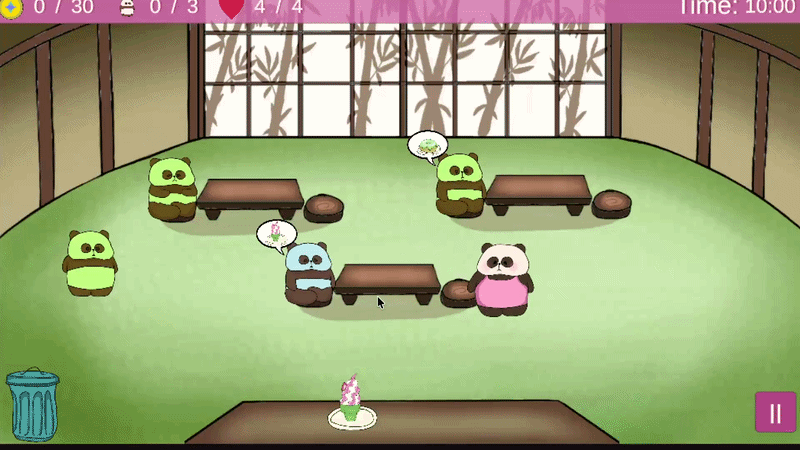
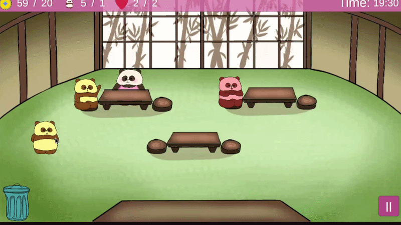
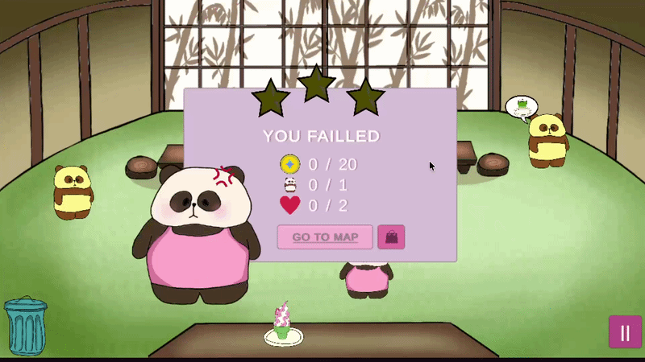
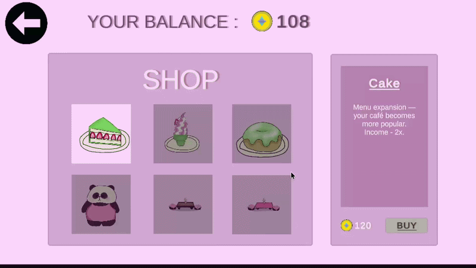
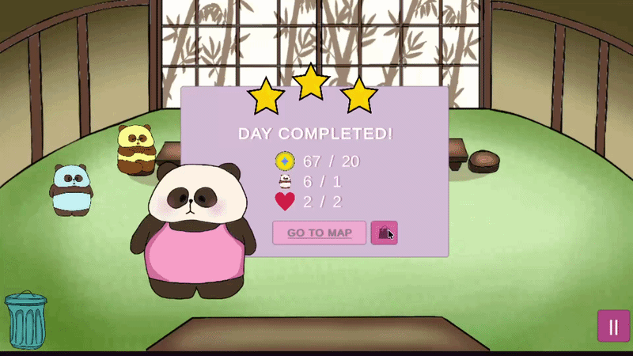
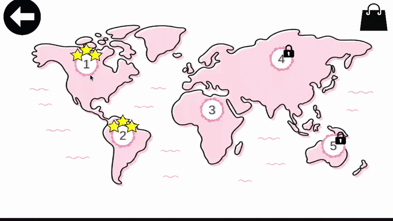

<div align="center">

# 🐼 Panda Café

**A cozy 2D café management game built with Unity.**

Serve guests, prepare cute desserts and drinks, earn coins, unlock levels, and upgrade your café into the sweetest panda spot in town.


</div>

---

## ✨ Overview

**Panda Café** is a charming 2D café management game where the player manages service flow across tables, the kitchen, guests, money, and shop upgrades.

The game is designed around short level-based sessions: complete goals, keep guests happy, collect rewards, and use your earnings to unlock new items and improve the café.

Beyond gameplay features, the project focuses heavily on scalable gameplay architecture, modular system design, and maintainable Unity development practices.

---

## 🎮 Gameplay Preview

<div align="center">

### Core Gameplay


### Day Completed


### You Failed


</div>

---

## 🛍️ Shop & Progression

<div align="center">

| Purchased Item | Locked Shop Item |
| --- | --- |
|  |  |

| Locked Levels |
| --- |
|  |

</div>

---

# 🌟 Features

- **Level-based café sessions** with goals for coins, served guests, and guest losses.
- **Guest service loop** with tables, kitchen interactions, food orders, and coins.
- **Progress tracking** for completed levels and earned stars.
- **Level map flow** with locked and unlocked levels.
- **Shop upgrades** for café items and gameplay improvements.
- **Reusable gameplay systems** built with modular architecture principles.
- **State-driven NPC logic** for guest flow and waiter interactions.
- **Event-driven communication** between gameplay systems and UI.
- **ScriptableObject-based configuration** for scalable content management.
- **Cozy 2D presentation** with animated guests, waiter, trash, food, and UI elements.

---

# 🧠 Architecture & Technical Design

The project was built with strong focus on maintainable code structure and scalable gameplay systems.

Instead of tightly coupling gameplay logic into single scripts, the architecture separates responsibilities into independent managers and reusable systems.

Main architectural goals:
- Low coupling between systems
- Clear gameplay flow organization
- Reusable gameplay components
- Easier scalability and debugging
- Production-oriented Unity structure

---

## 🧩 Main Systems

| System | Description |
| --- | --- |
| **Game Management** | Controls scene flow, global game state, player balance, and selected level. |
| **Level Management** | Tracks active level goals, timer/state, completion, failure, and stars. |
| **Guest & Orders** | Spawns guests, creates orders, handles patience, serving, and lost guests. |
| **Interaction** | Converts player clicks into interactions with tables, kitchen, trash, and other objects. |
| **Shop** | Displays upgrades, validates purchases, spends coins, and applies upgrade multipliers. |
| **UI** | Handles main menu, level map, level HUD, pause menu, shop item views, and result panels. |

---

# 🤖 NPC & Gameplay Logic

Guests and waiter behaviors are built around custom gameplay state logic.

NPC systems manage:
- Queue flow
- Table seating
- Food ordering
- Waiting timers
- Eating states
- Order delivery
- Leaving behavior

This approach keeps gameplay behavior modular and easier to extend with additional mechanics in the future.

---

# ⚡ Event-Driven Systems

Several gameplay systems communicate through event-driven architecture instead of direct hard references.

Examples include:
- UI reacting to gameplay events
- Currency updates
- Order completion
- Level progress tracking
- Guest state transitions

This reduced dependencies between systems and improved maintainability.

---

# 🗂️ Project Structure

```text
Panda-Cafe/
├── Assets/
│   ├── Animation/          # Character, UI, food, coin, and object animations
│   ├── Art/                # 2D art assets
│   ├── LevelSO/            # Level ScriptableObject assets
│   ├── Prefabs/            # Gameplay and UI prefabs
│   ├── Scenes/             # MainMenu, LevelMap, Game, and Shop scenes
│   ├── Scripts/            # C# gameplay, UI, input, shop, and level systems
│   └── SO/                 # Food, guest, and shop item ScriptableObjects
├── Packages/               # Unity package manifest and lock file
├── ProjectSettings/        # Unity project configuration
└── docs/media/             # README GIFs and preview media
```

---

# 🛠️ Built With

- **Unity 6000.4.0f1**
- **C#**
- **Universal Render Pipeline (URP)**
- **Unity Input System**
- **TextMesh Pro / Unity UI**
- **ScriptableObjects**
- **Object-Oriented Programming (OOP)**
- **Event-Driven Architecture**
- **State-Based NPC Logic**
- **Prefab-Based Workflow**
- **Coroutine-Based Gameplay Systems**

---

# 🚀 Development Focus

This project was created as a portfolio project with emphasis on improving practical skills in:

- Gameplay architecture
- Scalable Unity systems
- Maintainable code organization
- AI behavior logic
- Modular gameplay design
- Decoupled system communication
- Production-style project structure

---

# 🚀 Getting Started

## Requirements

- Unity **6000.4.0f1** or a compatible Unity 6 version
- Git

## Run Locally

1. Clone the repository:

   ```bash
   git clone https://github.com/<your-username>/Panda-Cafe.git
   ```

2. Open the project in Unity Hub.
3. Select Unity version **6000.4.0f1** when prompted.
4. Open the `MainMenu` scene from `Assets/Scenes/`.
5. Press **Play**.

---

# 📌 Current Scenes

- `MainMenu`
- `LevelMap`
- `Game`
- `Shop`

---

# 🧡 Credits

Created with care as a cozy café management project focused on gameplay systems, architecture, and scalable Unity development practices.

---

<div align="center">

**Panda Café** — serve guests, earn coins, and grow your adorable café. 🐼☕

</div>
